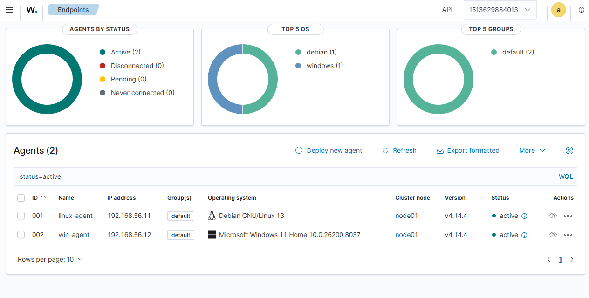
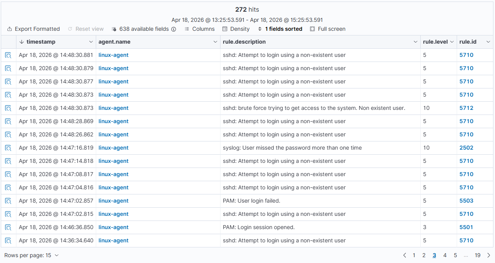
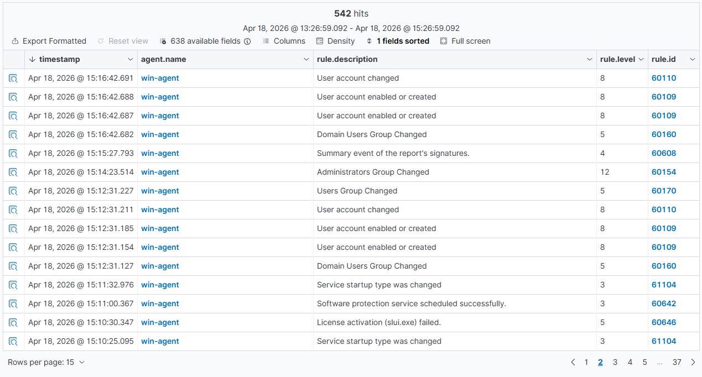

# Wazuh SIEM Home Lab

## Overview

This project is a home SIEM lab built using Wazuh to practice security monitoring, detection, and basic incident analysis.

The lab includes:

* a Wazuh server deployed with Docker Compose on Debian
* one Debian Linux endpoint
* one Windows 11 endpoint

The goal of this project was to simulate security-relevant activity and analyze how Wazuh detects and presents those events.

---

## Lab Architecture

* **Wazuh Server:** Debian VM running Wazuh in Docker (single-node setup)
* **Linux Endpoint:** Debian VM with Wazuh agent
* **Windows Endpoint:** Windows 11 VM with Wazuh agent


### Networking

* NAT adapter → internet access
* Internal Network (`wazuh-lab`) → communication between agents and server

---

## Technologies Used

* Wazuh SIEM
* Docker & Docker Compose
* Debian Linux
* Windows 11
* VirtualBox

---

## Objectives

* Deploy a working SIEM platform
* Connect Linux and Windows endpoints
* Simulate suspicious activity
* Analyze logs and alerts
* Practice basic SOC (Security Operations Center) workflows

---

## Simulated Security Events

### Linux

* Failed SSH login attempts
* Login attempts using non-existent users
* Sudo activity

### Windows

* User account creation
* User account modification
* Adding users to the Administrators group

---

## Key Detections

### Linux Authentication Failures

Detected:

* `sshd: Attempt to login using a non-existent user`
* `PAM: User login failed`

These events indicate failed authentication attempts and potential brute-force activity.

---

### Windows Account Creation

Detected:

* `User account enabled or created`
* `User account changed`

These events show account provisioning activity.

---

### Windows Privilege Escalation

Detected:

* `Administrators Group Changed`

This indicates that a user was added to the Administrators group, which is a high-risk security event.

---

## Example Scenario

A test user (`tempuser`) was created and then added to the Administrators group.

### Actions performed:

```powershell
net user tempuser P@ss123 /add
net localgroup administrators tempuser /add
```

### Observed in Wazuh:

* User creation events
* Account modification events
* Administrator group change (high severity)

### Interpretation:

This behavior may indicate:

* legitimate administrative activity
* or potential privilege escalation by an attacker

---

## Screenshots

### Agents Connected


### Linux Failed Logins


### Windows User Creation & Privilege Escalation


---

## What I Learned

* Deploying Wazuh in a Docker environment
* Connecting and troubleshooting agents
* Configuring virtual lab networking
* Detecting suspicious authentication behavior
* Identifying privilege escalation patterns
* Basic event correlation and analysis

---

## Future Improvements

* Add more attack simulations
* Create custom detection rules
* Simulate full attack chains (multi-step scenarios)
* Improve log correlation and alerting

---

## Author

Alex Pära

System administration background with a strong interest in cybersecurity, detection engineering, and blue team operations.
