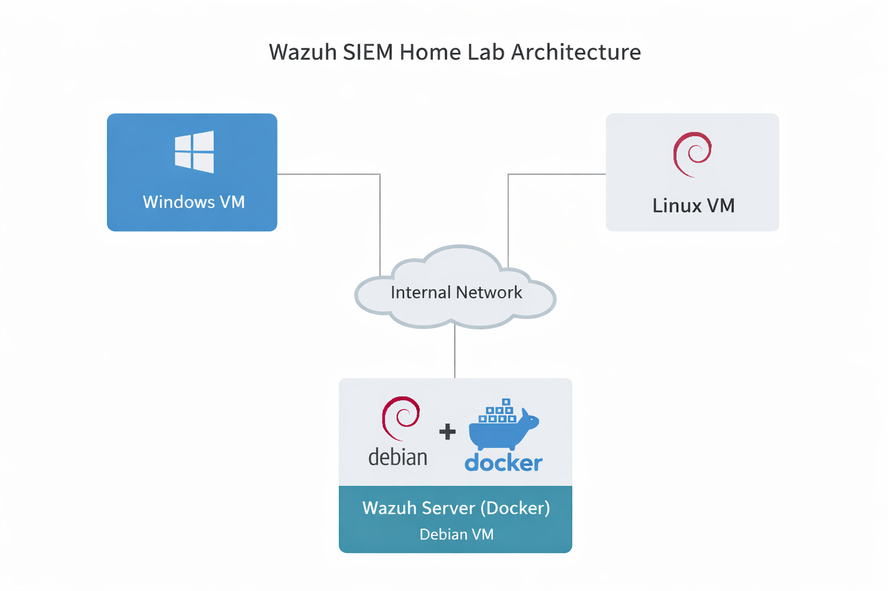

# Architecture

This diagram shows the structure of the Wazuh SIEM home lab.

- Wazuh server runs in Docker on a Debian VM
- Linux and Windows endpoints send logs to the Wazuh server via an internal network.

