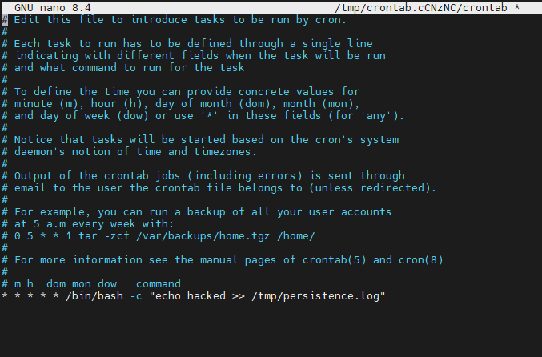
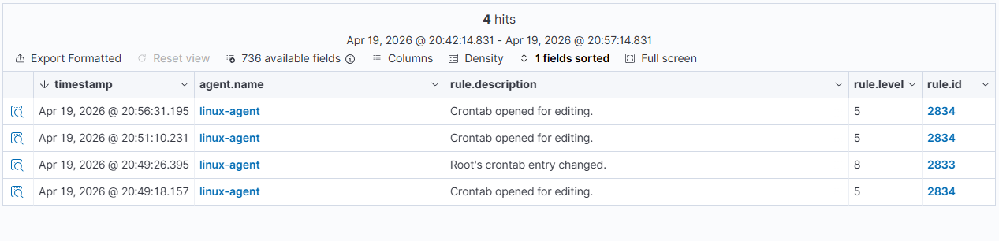

# Linux Persistence via Cron Job

## Overview

This scenario demonstrates a persistence technique on a Linux system by creating a cron job that executes periodically.

Persistence is commonly used by attackers to maintain access to compromised systems after initial access.

---

## Lab Environment

* Wazuh SIEM (Docker, single-node)
* Linux agent (Debian 13)
* Internal network communication

---

## Simulation Steps

### 1. Open crontab

On the Linux agent:

```
crontab -e
```

---

### 2. Add persistence entry

Insert the following line:

```
* * * * * /bin/bash -c "echo hacked >> /tmp/persistence.log"
```

This creates a scheduled task that runs every minute.

---

### 3. Verify persistence

Wait 1–2 minutes, then check:

```
cat /tmp/persistence.log
```

You should see repeated entries confirming execution.

---

## Detection

Wazuh successfully detected the persistence activity through:

* Crontab modification monitoring
* System configuration tracking

---

## Example Alerts

### Event 1: Crontab Edited

* Rule ID: 2834
* Description: Crontab opened for editing
* Level: 5

### Event 2: Persistence Created

* Rule ID: 2833
* Description: Root's crontab entry changed
* Level: 8

---

## MITRE ATT&CK Mapping

* T1053 — Scheduled Task / Job
* T1547 — Boot or Logon Autostart Execution

---

## Screenshots

### Cron Job Creation



### Wazuh Detection



---

## Analysis

This activity demonstrates how attackers can establish persistence using scheduled tasks.

Key observations:

* Cron jobs are a simple but effective persistence mechanism
* Wazuh detects configuration changes without needing custom rules
* Monitoring system-level changes is critical for detecting persistence techniques

---

## Key Takeaways

* Persistence can be achieved using built-in system tools like cron
* Wazuh provides visibility into configuration changes such as scheduled tasks
* Even basic persistence techniques generate detectable events in SIEM

---

## Conclusion

This scenario shows that Wazuh can effectively detect persistence techniques on Linux systems by monitoring system configuration changes such as cron job modifications.
